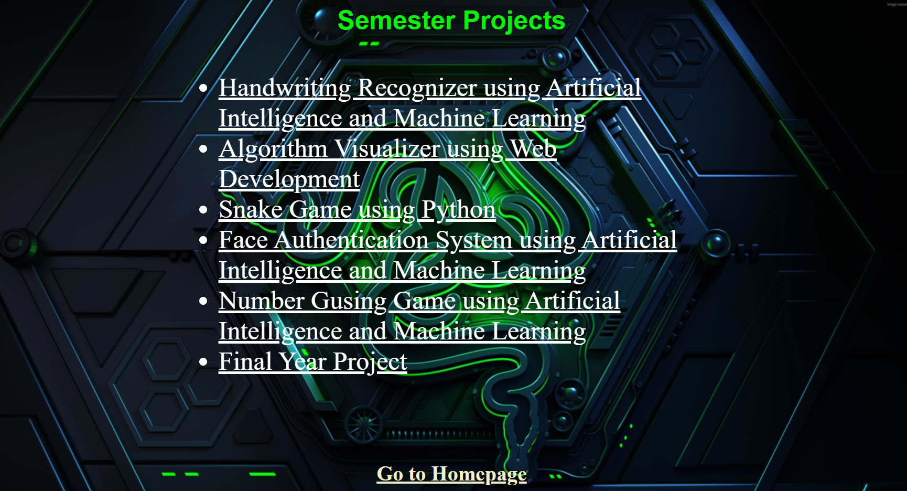
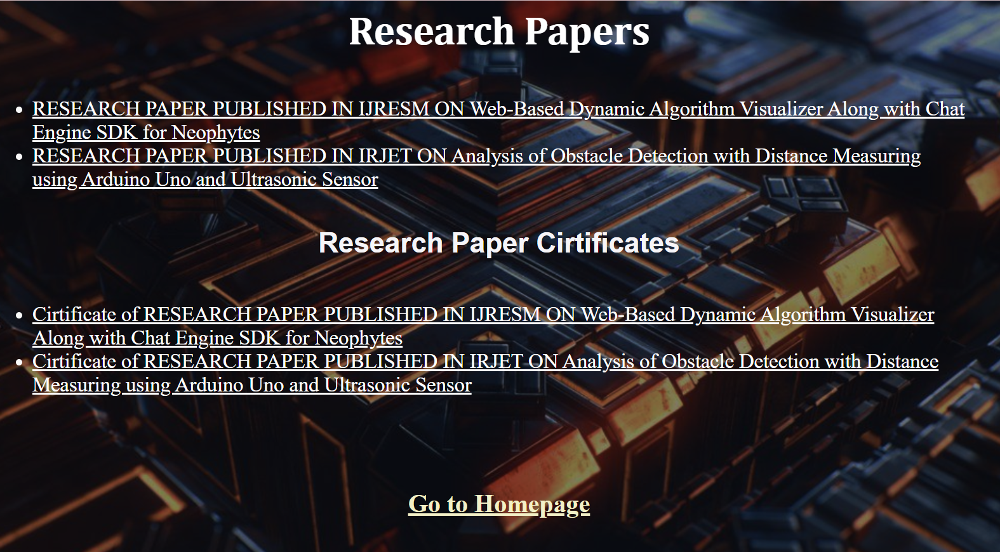

# ANKITA-S_CV_website :star_struck: :open_mouth: :sunglasses: :facepunch:

***This new Web Page is created by Ankita Sikder, students of BTECH, in University of Engineering and Management, Kolkata.***

***Email Id: ankita.sikder14@gmail.com.***

  

## About :point_down:

  

***LINK : :point_right: https://ankitasikder.github.io/ANKITA-S_CV_website/***
  
## Why I have made this :point_down:

## Some Resources of this project :point_down:

     

     
## Some Screenshots of this project :point_down:

     
 

 

 
  
 
  
 
  

  
 

